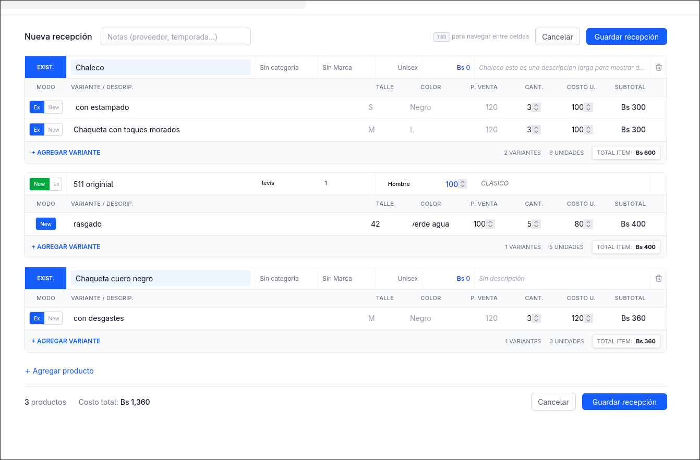

# 📦 Inventory System Frontend

A high-performance, modern web application built with **Angular 21** to manage complex inventory workflows. This project serves as the interface for the Inventory System Backend, focusing on efficiency, modularity, and advanced keyboard navigation.
<p align="center">
  
</p>
---

## 🚀 Key Features

### 🔐 Dynamic Role-Based Navigation
- Sidebar menu is dynamically fetched and rendered based on the authenticated user's permissions.

### 🏢 Multi-Branch Management
- Supports branch-specific contexts.
- Users can toggle between authorized locations during a session.

### ⚡ Advanced Receptions Module
- **Keyboard-Optimized Workflow**: Designed for fast data entry with minimal mouse usage.
- **Complex Variant Handling**:
  - Size
  - Color
  - Price
  - Description
- **Intelligent Creation Flow**:
  - Add new products with variants
  - Append variants to existing products

### 📊 Comprehensive Product Tracking
- Real-time stock visibility per branch
- Full transaction history (stock in/out)
- Category-based filtering and management

---

## 🛠 Tech Stack

- **Framework:** Angular 21  
- **State Management:** Angular Signals  
- **Forms:** Reactive Forms  
- **Security:** JWT (JSON Web Tokens)  
- **Architecture:** Component-based with separation of concerns  

---

## 📦 Installation & Setup

### 1. Clone the repository
```bash
git clone https://github.com/ronaldz012/inventory_system.git
cd inventory_system
```
### 2. Install dependencies

```bash
npm install
```

### 3. Environment Configuration

Edit:

`src/environments/environment.development.ts`

```ts
export const environment = {
  BACKEND_URL: "http://localhost:5253"
};
```

> Make sure this URL matches your backend API.

---

### 4. Run the application

```bash
ng serve
```

Open: http://localhost:4200/

---

## 📂 Project Structure

```
src/app/
│
├── core/                # Auth services, JWT interceptors, route guards
│   ├── dashboard/
│   └── login/
│
├── shared/              # Reusable UI components and utilities
│
└── features/            # Main modules
    ├── receptions/      # Product & variant entry engine
    └── products/        # Product listing & tracking
```

---

## 🔗 Backend Reference

](https://github.com/ronaldz012/DriveCore.System.Monolith)
---

## ⚙️ Receptions Workflow

When adding products, the system checks for existing variants:

- ➕ Add **New Product + New Variants**
- 🔄 Select **Existing Product + New Variants**
- 📦 Select **Existing Product + Existing Variants** (stock update)
